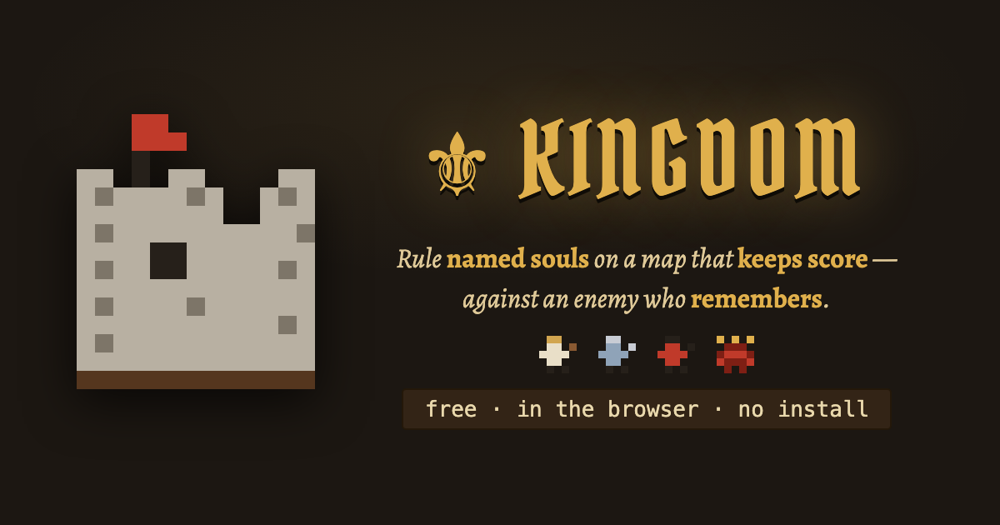
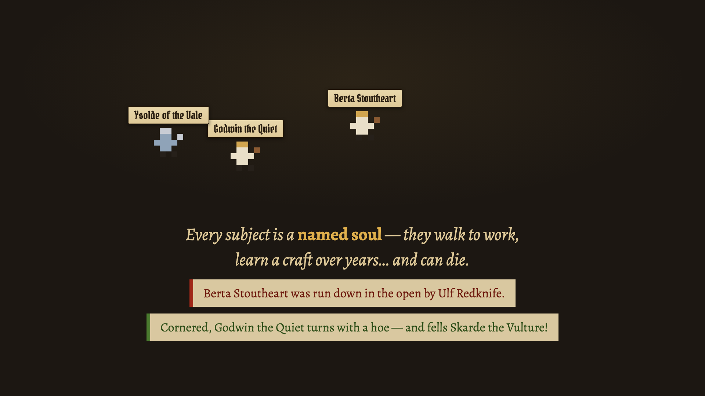
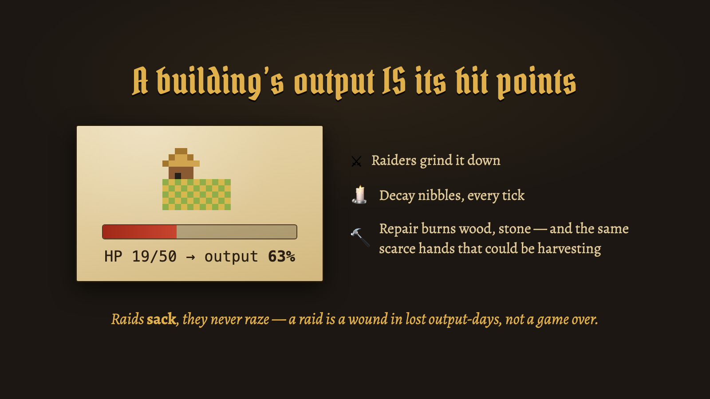
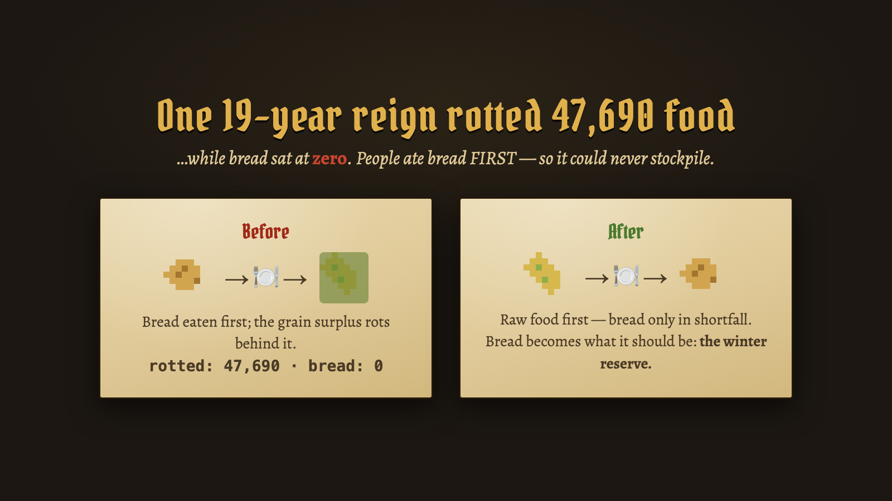
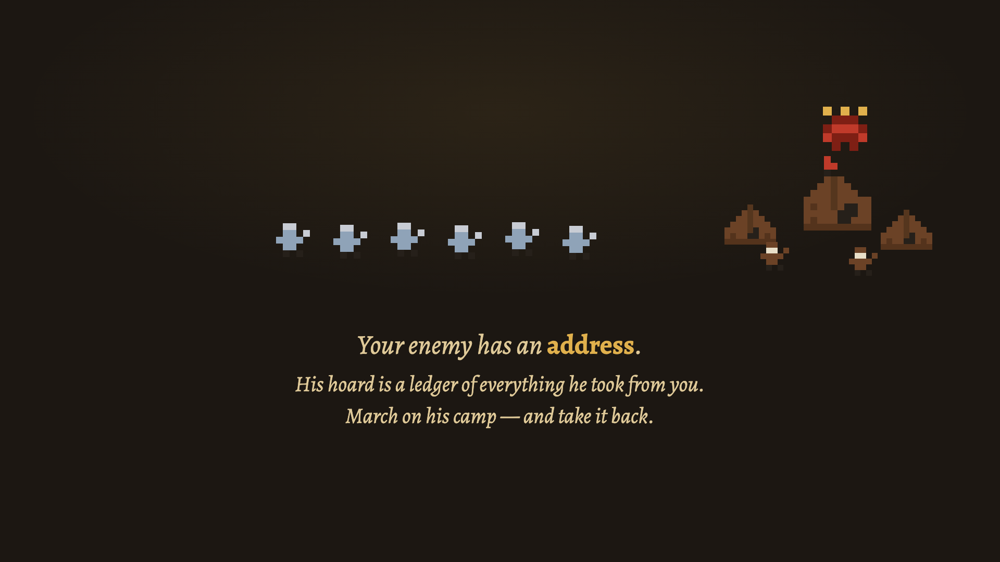
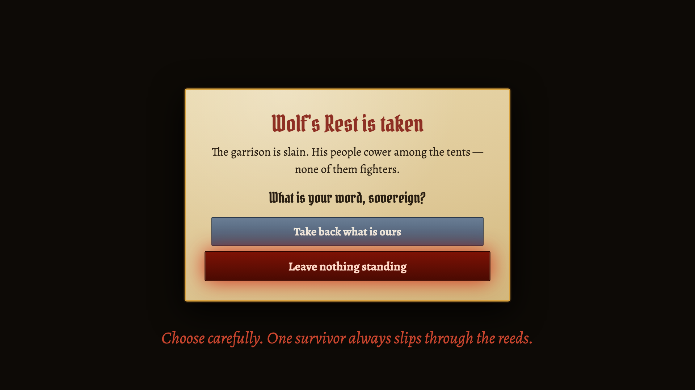

# ⚜ Kingdom

**A medieval realm simulator — rule named souls on a map that keeps score, against an enemy who remembers.**

Free, in the browser, no install: **[play it here](https://kingdom-sim-fawn.vercel.app/)** · [landing page](https://kingdom-sim-fawn.vercel.app/landing.html)



Kingdom is a real-time medieval ant farm. You place the buildings and set the course; your subjects do the rest — walk to work, learn their crafts, flee for the keep when the horn sounds, and die with their names in the chronicle. There is no fog of war, no hard game over, and almost no micromanagement. There is only a realm, the winters, and the people who keep coming back for what you've built.

## Every soul has a name

Population isn't a number — it's a roster. Villagers are bodies on the map with names, jobs, and skills that grow by doing. Work a farm for years and you become a master whose hands double its output; die, and the knowledge dies too. Raiders have names as well, so the chronicle reads like a saga: *"Cornered, Berta Stoutheart turns with a hoe — and fells Ulf Redknife!"*



## Buildings don't die — they bleed

A building's hit points **are** its output. Raiders sack, they don't raze: they grind a farm to a gutted 15% and move on, and your builders — competing for the same scarce hands as your fields — patch it back up at a price in wood and stone. Every raid is an economic wound measured in lost output-days, and recovery-versus-decay is where kingdoms quietly die.



## The map is finite, and the economy eats it

Every forest tile holds real timber; every hill, real stone; every vein, real ore. Camps cut the nearest standing wood until the land lies open for the plough — then strike their own tents and follow the forest. Spent veins fall back to quarryable hills. Over a long reign the wood-line visibly recedes, the hills flatten, and your roads stretch farther and farther to reach ground that still bears. Grain rots if you hoard it raw; bread keeps — the bakery is how a surplus becomes a siege reserve.



## An enemy with an address

Raids don't come from nowhere. The first raid founds a brigand nest in the far wilds; when your realm grows worth the march, a warlord claims it — and from then on his waves *mass visibly at the tents* before they march, his hoard fills with everything he takes from you, and his rider arrives ahead of each dread wave demanding Danegeld. Pay, and the next demand grows. Refuse, and he comes now.

Or march on him. Send every sword you have across the map — the kingdom standing thinner behind them — and if you take his camp, the game pauses and asks who you are:



**Take back what is yours** — burn the war-tents, spare his people, and some will drift to your gates in the years after, remembering it. **Or leave nothing standing** — and one survivor always slips through the reeds, and returns with a name, and cannot be bought.



## The Four Crowns

Three crowns for a realm that survives — **Dominion** (a third of all claimable land), **Plenty** (a treasury banked at once), **the People** (subjects housed and fed). And beyond survival, the Ladder of Great Works: a Guildhall raised by your masters, a Great Temple whose festivals sing the old year's fears away, and the High Seat — years of labor, five hoards' draught staged lootably on the scaffold, every raider from here to the sea hearing of what you pile there. Completing it is the fourth crown: **the Crown of Ages**.

## Under the hood

- **Everything is generated in code** — every sprite is a pixel matrix, the map is seeded noise, the raid horn is two sawtooth oscillators, and the teaser's soundtrack is a 226-line Node script that writes a WAV.
- **Design by simulation** — the economy and combat were tuned by thousands of headless Monte Carlo runs before they shipped ([`sim2/`](sim2/), [`model/`](model/)). The design record lives in [`docs/DECISIONS.md`](docs/DECISIONS.md) and [`design/`](design/).
- **The realm remembers** — every reign writes a full journal (births, trades, deaths with coordinates, a yearly census). Run `kingdom.export()` in the browser console to download your whole chronicle as a text file, grouped by year and season.

## Running it locally

```bash
npm install
npm run dev        # dev server
npm run build      # production build
npm run preview    # serve the build (the stable playtest server)
```

Headless tools, no browser needed:

```bash
node model/simulate.mjs 25 42        # a 25-year reign, seed 42, CSV to stdout
node model/polish-unit-checks.mjs    # the unit checks
node sim2/monte.mjs baseline --runs 120   # Monte Carlo over the design model
```

Built with [Vite](https://vitejs.dev/) and [Phaser](https://phaser.io/). Deployed on Vercel.
